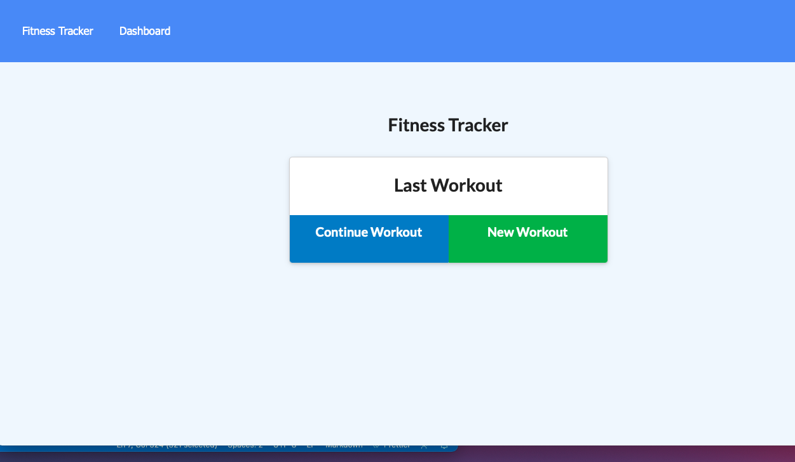
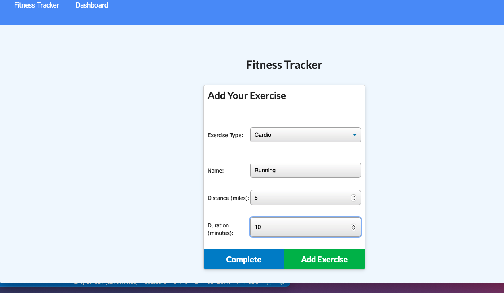
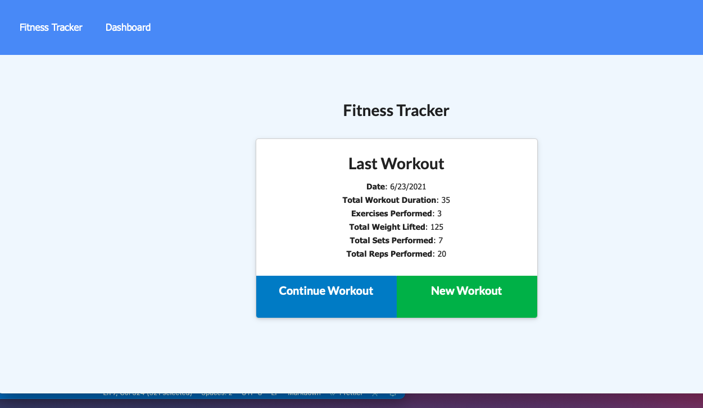
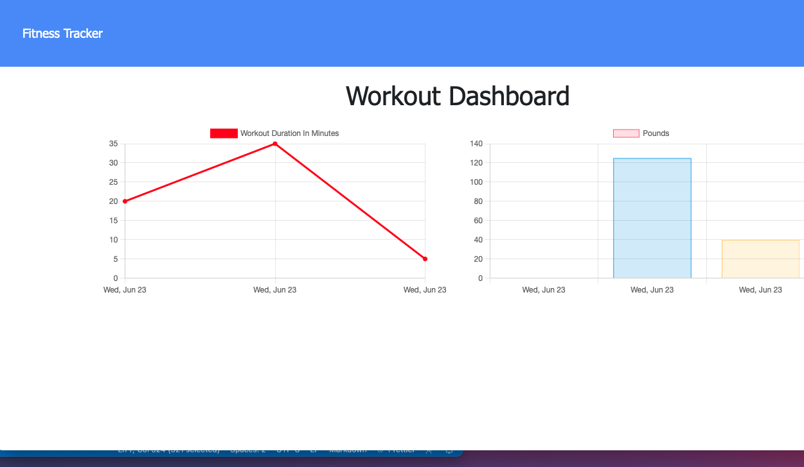

# Workout-Tracker

## Table of Contents

1. [Title](#title)
2. [Description](#Description)
3. [Installation](#Installation)
4. [Technologies](#Technologies)
5. [Collaboration](#Collaboration)
6. [Steps](#Steps)
7. [Walkthrough](#Screenshot)

# Description

- As a user, I want to be able to view create and track daily workouts. I want to be able to log multiple exercises in a workout on a given day. I should also be able to track the name, type, weight, sets, reps, and duration of exercise. If the exercise is a cardio exercise, I should be able to track my distance traveled.

# Installation

- To install: npm start

## Links

- https://github.com/MelElson/Workout-Tracker
- https://shrouded-beyond-16842.herokuapp.com/?id=60d3f0a7a07eb8001581e24f

# Technologies

The site uses Javascript, Node,js, Inquirer, Express, MYSQL, Mongo

# Collaboration

Pulls are encouraged. Any changes document.

# Steps

- - Add exercises to the most recent workout plan.

* Add new exercises to a new workout plan.

* View the combined weight of multiple exercises from the past seven workouts on the `stats` page.

* View the total duration of each workout from the past seven workouts on the `stats` page.

# Screenshot

